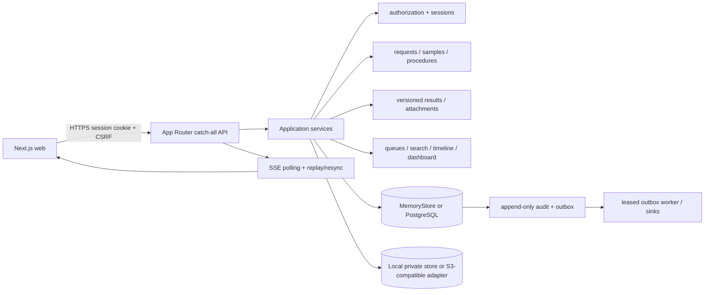

# Architecture

**Knowledge status:** `IMPLEMENTED LOCALLY / CONDITIONAL FOR PRODUCTION` — este documento descreve o código existente em 2026-08-23. Identidade hospitalar, ownership clínico, políticas e infraestrutura produtiva continuam gates externos.

## 1. Decision summary

O runtime é um monólito modular Next.js 16 (App Router), TypeScript, com API versionada no mesmo processo. O domínio usa `StateStore`: `MemoryStore` para desenvolvimento/testes e `PostgresStore` para persistência. PostgreSQL mantém hoje um snapshot JSONB autoritativo, audit/outbox/projeções e tabelas operacionais de suporte; essa fronteira está explicitamente marcada como transicional em `runtime_storage_boundaries` e não é apresentada como o modelo relacional clínico final.

Resultados e auditoria têm invariantes de domínio; outbox, idempotência, claims de upload, rate limit e readiness têm contratos persistentes. A decisão de migrar entidades clínicas para tabelas relacionais completas permanece um gate arquitetural antes de uma carga hospitalar representativa.

## 2. Runtime topology

There is no NestJS API in this repository. `src/app/api/v1/[...path]/route.ts` performs transport dispatch, strict body/header validation and envelope handling; `src/server/application/service.ts` composes bounded application modules.

## 3. Code boundaries

| Boundary | Location | Responsibility |
| --- | --- | --- |
| Web | `src/app`, `src/components` | authenticated shell, queues, request/result journeys, loading/error/degraded states |
| Transport | `src/app/api/v1/[...path]` | route matching, auth/session middleware, CSRF, rate limiting, request parsing, OpenAPI operation identity |
| Application | `src/server/application/*-service.ts` | request, workflow, result, attachment, management and read use cases |
| Domain | `src/server/domain` | state models, transitions and store contracts |
| Security | `src/server/security` | current-actor authorization, password/session policy, distributed rate-limit adapter |
| Persistence | `src/server/store` + `db/migrations` | memory/Postgres stores, migration ledger, readiness and projections |
| Files | `src/server/storage` | private local/S3-compatible bytes, checksum/MIME validation, external AV contract |
| Operations | `src/server/operations`, `scripts` | outbox claim/retry/ownership, SSE, metrics, migration/seed/worker entrypoints |

The former 2,800-line application service is split into modules; production source files are bounded below 800 lines. Dependency direction is route → application → domain ports/adapters, with no UI write bypassing the API.

## 4. Persistence boundary

PostgreSQL is required for the disposable integration harness and the configured runtime mode. Migrations `001`–`006` create the ledger, snapshot row, audit/outbox projections, outbox claim ownership, distributed rate-limit buckets and `runtime_storage_boundaries`; migrations `007`–`009` add the expand-only relational clinical/sample-lineage seam and its readiness contract. The latter records the current contract (`StoreState-v1`) and its transitional status so a future relational migration cannot silently change the source of truth.

Clinical release, void/amend, sample lineage (including complete item membership, exact replay and rollback) and audit/outbox writes are exercised in transactions and reloaded from PostgreSQL. A production decision still requires relational constraints/indexes for the clinical entities, representative `EXPLAIN` evidence and a tested expand/contract migration plan.

## 5. External boundaries

| Concern | Local contract | Production gate |
| --- | --- | --- |
| Identity | opaque server session, server-derived role/scope | hospital IdP/ownership, transfer/discharge and delegated authority |
| Files | private local adapter or S3-compatible adapter | bucket policy, encryption, backup, credentials and residency |
| Malware | local EICAR/checksum scanner outside production; HTTP scanner adapter | managed scanner endpoint, authentication, SLA and quarantine policy |
| Rate limit | in-memory only outside production; PostgreSQL fixed-window buckets in production | HA database capacity and operational alerting |
| Realtime | authorized SSE polling, bounded outbox window, heartbeat and `resync_required` | multi-instance fanout/worker and propagation benchmark |
| Critical results | release policy gate requires approved configuration | human-owned thresholds, recipient, fallback and escalation policy |

## 6. Failure behavior

- PostgreSQL or schema readiness failure: readiness is false and clinical commands do not claim success.
- Object storage or scanner failure: upload/release returns a safe retryable error; bytes are not exposed.
- Outbox worker failure: committed intent remains durable; a message is not completed without its current worker/token lease.
- SSE disconnect: the UI displays degraded state, reconnects and refetches authorized resources; SSE is never the source of truth.

## 7. Production posture

The repository is an executable synthetic MVP, not a hospital deployment. The release checklist in `docs/operations/PRODUCTION_READINESS.md` and the frozen bar in `docs/build/PREMIUM_MVP_V4.md` remain authoritative for external approval.
