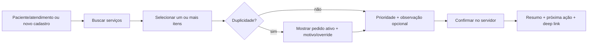

# UX user flows and wireflows

**Knowledge status (05/09/2026):** `IMPLEMENTED LOCALLY / CONDITIONAL FOR PRODUCTION` — os wireflows abaixo têm implementação em `src/components`. Os 51 casos Playwright passam em uma corrida única sem retry, com servidores de memória sintética isolados por projeto. A acessibilidade automatizada passou 6/6. O shell agora reconcilia atualizações por SSE e usa uma cadência de 30 s quando a conexão degrada; o Patient Workspace preserva o último snapshot confirmado quando um refresh fica indisponível; o browser usa memória sintética e não prova PostgreSQL. Aceitação clínica, carga representativa e inspeção manual continuam abertas.

**AAA-1:** [barra](../build/STATE_OF_ART_QUALITY_BAR.md) · [plano](../build/EXECUTIVE_IMPROVEMENT_PLAN.md) · [roadmap](../build/STATE_OF_ART_ROADMAP.md) · [backlog](../build/STATE_OF_ART_BACKLOG.md) · [auditoria de 04/09/2026](../PROJECT_STATUS_REPORT.md)

## 0. Current implementation evidence

- `RequestDetail` e `QueueView` usam a mesma `WorkflowAction` e refetch após mutações.
- Ações implementadas na UI: receber amostra, processamento, agenda, remarcação quando o procedimento expõe sua versão, execução, resultado draft, recoleta e recebimento de substituta.
- `ResultView` registra visualização, revisão, edição/liberação de draft, emenda, invalidação, anexos com checksum/MIME/scanner e download apenas após release/scan limpo.
- Loading, partial failure, permission/not-found, retry/reconcile e realtime degradado têm estados visíveis. O E2E atual usa seed sintético em memória; a integração PostgreSQL não foi executada porque o comando permanece condicionado a opt-in e banco vivo, e a evidência não representa prontuário hospitalar ou teste clínico.

## 1. Create request



Primary actions are select, priority and request; context is prefilled. If the patient is not in the list, the veterinarian selects `＋ Cadastrar paciente`, completes the patient/tutor fields and chooses the initial encounter type. The returned open encounter is inserted and selected in the same request flow. Error/unknown state keeps the user’s typed note locally until server result is known.

## 1.1 Register patient from the request flow

```text
Nova solicitação → Paciente → ＋ Cadastrar paciente → patient + encounter form → Cadastrar paciente
                                                                            ↓
                                      patient and open encounter selected → choose services → confirm request
```

The same form is available as `Novo paciente` in `Meus pacientes`. Inpatient registration adds required ward and bed fields. The server owns identifier generation, duplicate protection, scope assignment, audit and the atomic patient/encounter/admission write; the UI never fabricates a patient ID or encounter.

## 2. Laboratory queue

```text
Abrir Laboratório → filtros persistidos → item prioritizado → Receber → Iniciar → Resultado draft → Liberar → próxima fila
```

`RECOLLECTION_REQUIRED` branches to reason dialog → notification → replacement sample. No modal for every ordinary transition; confirmation proportional to clinical risk.

## 3. Imaging

```text
Abrir Imagem → queue/agenda → agendar (US) ou encaminhar (RX) → iniciar → realizar → laudo draft → liberar → revisar
```

Reschedule preserves prior slot and reason. Waiting for report is a clear status, not a generic spinner.

## 4. Result/review

```text
Notificação → deep link item → abrir versão atual [view event] → conteúdo/anexos → Revisar [server confirm] → concluído
```

If version changed, show stale conflict and require reopening. `Released`, `Viewed`, `Reviewed`, `Acknowledged` and `Completed` are different labels/actions.

## 5. Critical result

```text
Critical released → inbox high-priority → Open → Acknowledge receipt → Review/clinical action → policy close
                                             ↘ no ack → reminder/escalation queue
```

The interface never claims clinical communication merely because an SSE event was delivered.

## 6. Keyboard flow

Laboratory desktop may support shortcuts for focus/filter/next item, but every action remains reachable by standard keyboard and has visible focus. Shortcuts cannot bypass confirmation/authorization.
